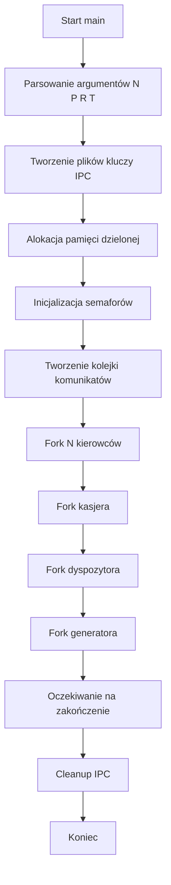
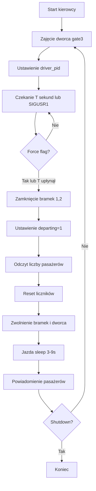
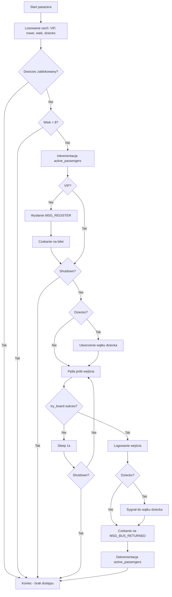
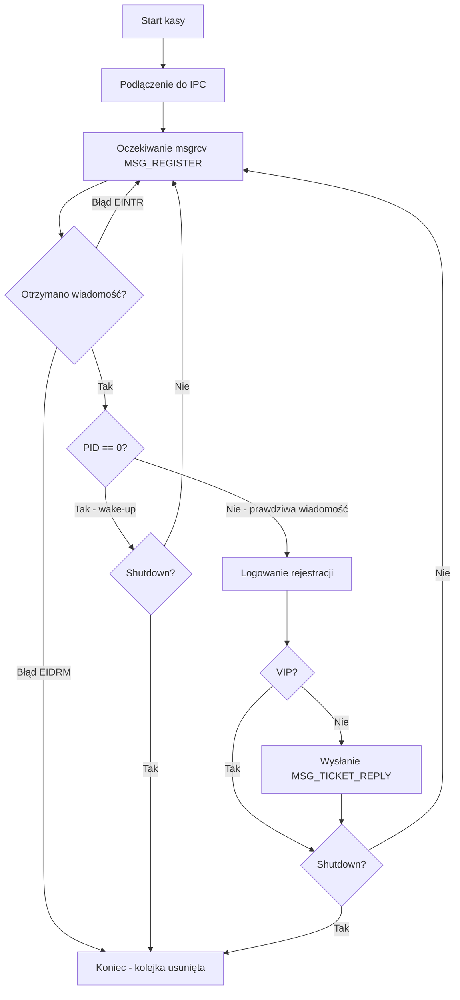
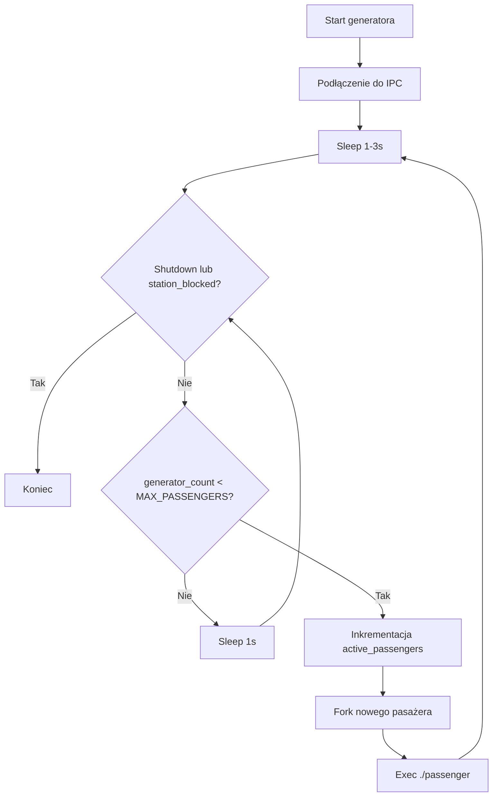

# 🚍 Symulacja „Autobus podmiejski"

Zaawansowana symulacja systemu obsługi autobusów podmiejskich wykorzystująca mechanizmy **System V IPC** (pamięć dzielona, semafory, kolejki komunikatów), sygnały POSIX, wielowątkowość oraz komunikację międzyprocesową. Projekt demonstruje praktyczne zastosowanie synchronizacji procesów w środowisku Linux.

---

## 📋 Spis treści

- [Funkcjonalności](#-funkcjonalności)
- [Wymagania systemowe](#️-wymagania-systemowe)
- [Struktura projektu](#-struktura-projektu)
- [Kompilacja](#-kompilacja)
- [Uruchomienie](#️-uruchomienie)
- [System logowania](#-system-logowania)
- [Sterowanie sygnałami](#-sterowanie-sygnałami)
- [Mechanizmy synchronizacji](#-mechanizmy-synchronizacji)
- [Przepływ procesów](#-przepływ-procesów)
- [Testy systemu](#-testy-systemu)
- [Użyte mechanizmy systemowe](#-użyte-mechanizmy-systemowe)
- [Nawigacja po kodzie źródłowym](#-nawigacja-po-kodzie-źródłowym)

---

## ⚡ Funkcjonalności

### Podstawowe mechanizmy
- **Flota N autobusów** o pojemności **P pasażerów** i **R miejsc na rowery**
- **Dwa niezależne wejścia** (normalne / z rowerem) synchronizowane semaforami bramek
- **Inteligentny system odjazdów** co **T** sekund z możliwością wymuszenia (SIGUSR1)
- **Losowe czasy powrotu** Ti ∈ **[3,9]** sekund dla każdego kursu
- **Tylko jeden autobus na dworcu** — zapewnione przez semafor dworca

### Obsługa pasażerów
- **Kasa biletowa** — rejestruje wszystkich pasażerów, wystawia bilety dla zwykłych dorosłych
- **Pasażerowie VIP (~1%)** — posiadają wcześniej zakupiony bilet, tylko rejestracja
- **Dzieci < 8 lat** — nie mogą podróżować bez opiekuna (automatyczna odmowa)
- **Dorośli z dziećmi** — zajmują 2 miejsca, dziecko jako osobny wątek synchronizowany przez mutex i condition variable
- **Pasażerowie z rowerami** — używają dedykowanej bramki (semafora 2)
- **Generator pasażerów** — tworzy nowych pasażerów co 1-3 sekundy w nieskończoność

### Kontrola systemu
- **Dyspozytor** — nadzoruje pracę kierowców, może wymusić odjazd lub zablokować dworzec
- **Wymuszenie odjazdu (SIGUSR1)** — przedwczesny odjazd autobusu przed upływem czasu T
- **Blokada dworca (SIGUSR2)** — stopniowe zamknięcie systemu z oczekiwaniem na zakończenie procesów
- **Graceful shutdown (SIGINT)** — kontrolowane zakończenie z czyszczeniem zasobów IPC
- **Raport szczegółowy** w pliku `report.txt` z timestampami wszystkich zdarzeń

---

## 🖥️ Wymagania systemowe

- **System operacyjny**: Linux (testowane na Ubuntu 24.04, Debian, Raspberry Pi OS)
- **Kompilator**: GCC z obsługą standardu C99 lub nowszego oraz biblioteki pthread
- **Pakiety**: `build-essential`, `make`
- **Uprawnienia**: Możliwość tworzenia zasobów System V IPC
- **Biblioteki**: pthread (standardowo dostępna w systemach Linux)

---

## 📁 Struktura projektu

```
.
├── ipc.h                    # Definicje struktur i stałych IPC
├── main.c                   # Proces główny (inicjalizacja systemu)
├── driver.c                 # Proces kierowcy autobusu
├── cashier.c                # Proces kasy biletowej
├── dispatcher.c             # Proces dyspozytora (zarządzanie sygnałami)
├── passenger.c              # Proces pasażera z obsługą wątków
├── passenger_generator.c    # Generator procesów pasażerów
├── Makefile                 # Automatyzacja kompilacji i czyszczenia
├── README.md                # Dokumentacja projektu
└── report.txt               # Log zdarzeń (tworzony automatycznie)
```

### Krótki opis plików

| Plik | Odpowiedzialność |
|------|------------------|
| **ipc.h** | Definicje struktur `BusState`, `msg`, stałych `MSG_*` oraz ścieżek kluczy IPC |
| **main.c** | Inicjalizacja IPC, tworzenie procesów potomnych, obsługa shutdown, sprzątanie zasobów |
| **driver.c** | Cykl pracy autobusu: przyjazd → oczekiwanie T sekund → odjazd → jazda Ti sekund → powrót |
| **cashier.c** | Odbieranie rejestracji pasażerów, wysyłanie biletów dla dorosłych nie-VIP |
| **dispatcher.c** | Obsługa sygnałów SIGUSR1 (wymuszenie), SIGUSR2 (blokada), przekazywanie do kierowcy |
| **passenger.c** | Losowanie cech, rejestracja w kasie, czekanie na bilet, próby wejścia, wątki pthread dla dzieci |
| **passenger_generator.c** | Nieskończone tworzenie pasażerów co 1-3 sekundy aż do shutdown |

---

## 🔨 Kompilacja

W katalogu projektu wykonaj:

```bash
make
```

Powstaną pliki wykonywalne:
- `./main` — proces główny
- `./driver` — kierowca autobusu
- `./cashier` — kasa biletowa
- `./dispatcher` — dyspozytor
- `./passenger` — proces pasażera
- `./passenger_generator` — generator pasażerów

### Czyszczenie zasobów

```bash
make clean
```

Usuwa pliki binarne, logi, pliki kluczy IPC i czyści zasoby systemowe (pamięć dzielona, semafory, kolejki).

---

## ▶️ Uruchomienie

Program główny wymaga **4 parametry**:

```bash
./main N P R T
```

### Parametry

- **N** — liczba autobusów w systemie (np. `3`)
- **P** — maksymalna pojemność autobusu w osobach (np. `20`)
- **R** — maksymalna liczba rowerów w autobusie (np. `5`)
- **T** — czas oczekiwania autobusu na dworcu w sekundach (np. `5`)

### Przykład uruchomienia

```bash
./main 3 20 5 5
```

Uruchamia system z **3 autobusami**, każdy o pojemności **20 pasażerów**, **5 miejsc na rowery**, czas oczekiwania **5 sekund**.

### Weryfikacja działania

Po uruchomieniu system tworzy następujące logi:
- `report.txt` — główny raport zdarzeń
- `driver.log` — szczegółowe logi kierowców
- `passenger.log` — szczegółowe logi pasażerów
- `cashier.log` — logi kasy biletowej
- `dispatcher.log` — logi dyspozytora
- `generator.log` — logi generatora pasażerów

---

## 📊 System logowania

### Format wpisów w report.txt

```
[HH:MM:SS] [PROCES] Opis zdarzenia
```

### Przykład logu

```
[21:22:38] [KIEROWCA 142472] Autobus na dworcu
[21:22:38] [PASAZER 142591] Wsiadl (VIP=0 rower=1)
[21:22:38] [PASAZER 142596] Wsiadl (VIP=0 rower=1)
[21:22:39] [DOROSLY+DZIECKO 142568] Wsiadl (VIP=0 rower=1)
[21:22:43] [KIEROWCA 142472] Odjazd: 6 pasazerow, 5 rowerow
[21:22:52] [KIEROWCA 142472] Powrot po 9s
```

### Typy zdarzeń

| Zdarzenie | Opis |
|-----------|------|
| **Autobus na dworcu** | Kierowca zajął dworzec i oczekuje na pasażerów |
| **Przybycie** | Pasażer pojawił się na dworcu |
| **Wsiadl** | Pasażer pomyślnie wszedł do autobusu |
| **Odjazd** | Autobus rozpoczął trasę |
| **Powrot** | Autobus wrócił po rozwiezieniu pasażerów |
| **Dojechalem** | Pasażer dotarł do celu |

---

## 🎛️ Sterowanie sygnałami

System reaguje na następujące sygnały:

### SIGUSR1 — Wymuszenie odjazdu

```bash
# Znajdź PID dyspozytora
ps aux | grep dispatcher

# Wyślij sygnał wymuszenia odjazdu
kill -USR1 <PID_DYSPOZYTORA>
```

**Efekt**: Aktualnie stojący autobus odjeżdża natychmiast (przed upływem czasu T).

### SIGUSR2 — Blokada dworca

```bash
kill -USR2 <PID_DYSPOZYTORA>
```

**Efekt**: 
1. Dworzec zostaje zablokowany (`station_blocked = 1`)
2. Nie mogą powstawać nowi pasażerowie
3. Obecni pasażerowie mogą dokończyć jazdę
4. System kończy pracę po powrocie ostatniego autobusu

### SIGINT (Ctrl+C) — Graceful shutdown

```bash
# W terminalu z uruchomionym systemem
Ctrl+C
```

**Efekt**:
1. Ustawienie flag `shutdown` i `station_blocked`
2. Powiadomienie wszystkich procesów
3. Zakończenie generatora i kasy
4. Oczekiwanie na powrót aktywnych autobusów
5. Czyszczenie zasobów IPC

---

## 🔐 Mechanizmy synchronizacji

### Semafory (System V)

System wykorzystuje **5 semaforów**:

| Indeks | Nazwa | Inicjalna wartość | Funkcja |
|--------|-------|-------------------|---------|
| **0** | `mutex` | 1 | Ochrona pamięci dzielonej (`BusState`) |
| **1** | `gate_bike` | 1 | Bramka dla pasażerów z rowerami |
| **2** | `gate_normal` | 1 | Bramka dla pasażerów bez rowerów |
| **3** | `dworzec` | 1 | Ograniczenie do jednego autobusu na dworcu |
| **4** | `generator_limit` | `MAX_PASSENGERS` | Limit aktywnych procesów pasażerów |

### Pamięć dzielona (struct BusState)

```c
struct BusState {
    /* Konfiguracja */
    int P, R, T, N;
    
    /* Stan autobusu na dworcu */
    int passengers;           // Aktualna liczba pasażerów
    int bikes;                // Aktualna liczba rowerów
    int departing;            // Flaga odjazdu (blokada wsiadań)
    
    /* Stan globalny */
    int station_blocked;      // Dworzec zablokowany
    int shutdown;             // System się kończy
    int active_passengers;    // Liczba wszystkich aktywnych pasażerów
    int boarded_passengers;   // Łączna liczba pasażerów którzy wsiedli
    pid_t driver_pid;         // PID kierowcy na dworcu
    
    /* Lista pasażerów */
    pid_t passenger_list[MAX_BUS_CAPACITY];
    int passenger_count;
};
```

### Kolejka komunikatów

**Typy wiadomości**:
- `MSG_REGISTER (1)` — Rejestracja pasażera w kasie
- `MSG_TICKET_REPLY + PID` — Odpowiedź z biletem dla konkretnego pasażera
- `MSG_BUS_RETURNED + PID` — Powiadomienie o powrocie autobusu (dla pasażerów)

### Wątki pthread (dla dzieci)

Pasażer z dzieckiem tworzy **wątek potomny**:
- **Rodzic** zarządza procesem wsiadania
- **Dziecko** czeka na synchronizację przez `pthread_mutex` i `pthread_cond`
- Po udanym wejściu rodzic budzi dziecko sygnałem condition variable

---

## 🔄 Przepływ procesów

### 1. Inicjalizacja (main.c)



### 2. Cykl pracy autobusu (driver.c)



### 3. Proces pasażera (passenger.c)



### 4. Proces kasy (cashier.c)



### 5. Generator pasażerów (passenger_generator.c)



---

## 🧪 Testy systemu

### Test 1: Równoczesne wejście pasażerów z rowerami

**Cel**: Weryfikacja poprawnego zarządzania dwoma zasobami jednocześnie: miejscami dla pasażerów i miejscami na rowery.

**Dane wejściowe**: `N=3, P=20, R=5, T=5`

**Przebieg**:
- Generator tworzy głównie pasażerów z rowerami
- Kilku pasażerów próbuje wejść jednocześnie
- Sprawdzenie, czy nie zostaje przekroczony limit rowerów
- Obserwacja stanu pamięci współdzielonej

**Rezultat**: ✅ **Pozytywny**. Limit rowerów nigdy nie zostaje przekroczony. Nadmiarowi pasażerowie czekają na kolejny kurs.

**Przykładowe fragmenty logów**:
```
[21:22:38] [KIEROWCA 142472] Autobus na dworcu
[21:22:38] [PASAZER 142591] Wsiadl (VIP=0 rower=1)
[21:22:38] [PASAZER 142596] Wsiadl (VIP=0 rower=1)
[21:22:38] [PASAZER 142597] Wsiadl (VIP=0 rower=1)
[21:22:39] [PASAZER 142567] Wsiadl (VIP=0 rower=1)
[21:22:39] [DOROSLY+DZIECKO 142568] Wsiadl (VIP=0 rower=1)
[21:22:43] [KIEROWCA 142472] Odjazd: 6 pasazerow, 5 rowerow
```

---

### Test 2: Czy pasażerowie VIP pomijają kasę

**Cel**: Weryfikacja, czy pasażerowie VIP mogą wejść do autobusu z pominięciem kasy, nawet gdy proces kasjera jest niedostępny.

**Dane wejściowe**: `N=2, P=12, R=3, T=3`

**Przebieg**:
- Proces kasy zostaje celowo uśpiony na 1 minutę
- W tym czasie generator tworzy nowych pasażerów
- Zwykli pasażerowie nie mogą przejść procesu rejestracji ani wejść do autobusu
- Pasażerowie VIP omijają kasę i mogą wejść do autobusu
- Obserwacja logów wejścia pasażerów oraz aktywności procesu kasy

**Rezultat**: ✅ **Pozytywny**. W czasie uśpienia kasy zwykli pasażerowie pozostają zablokowani, natomiast pasażerowie VIP mogą normalnie wejść do autobusu. Po wznowieniu pracy kasy zwykli pasażerowie są obsługiwani standardowo.

**Przykładowe fragmenty logów**:
```
[22:04:54] [PASAZER 146189] Przybycie (VIP=0 wiek=66 rower=0 dziecko=1)
[22:04:55] [PASAZER 146212] Przybycie (VIP=1 wiek=28 rower=1 dziecko=0)
[22:04:55] [PASAZER 146212] Wsiadl (VIP=1 rower=1)
[22:04:58] [KIEROWCA 146122] Odjazd: 1 pasazerow, 1 rowerow
[22:04:59] [KIEROWCA 146123] Autobus na dworcu
[22:04:59] [PASAZER 146217] Wsiadl (VIP=1 rower=1)
[22:05:02] [KIEROWCA 146122] Powrot po 4s
[22:05:02] [KIEROWCA 146122] Rozwieziono pasazerow: [146212]
```

---

### Test 3: Race condition przy natychmiastowym odjeździe autobusu

**Cel**: Sprawdzenie spójności stanu systemu, gdy autobus odjeżdża w chwili aktywnego wsiadania pasażerów.

**Dane wejściowe**: `N=1, P=10, R=5, T=5`

**Przebieg**:
- W trakcie masowego wsiadania dyspozytor wysyła sygnał SIGUSR1 (natychmiastowy odjazd)
- Proces kierowcy ustawia flagę `departing = 1`
- Weryfikacja, czy żaden pasażer nie pozostaje w stanie pośrednim
- Sprawdzenie atomowości operacji wsiadania

**Rezultat**: ✅ **Pozytywny**. Każdy pasażer kończy operację w sposób atomowy: albo wsiada i jest na liście `passenger_list`, albo nie wsiada i pozostaje na przystanku.

**Przykładowe fragmenty logów**:
```
[22:58:50] [KIEROWCA 151678] Autobus na dworcu
[22:58:50] [PASAZER 151685] Wsiadl (VIP=0 rower=1)
[22:58:50] [PASAZER 151683] Wsiadl (VIP=0 rower=1)
[22:58:50] [PASAZER 151686] Wsiadl (VIP=0 rower=1)
[22:58:50] [PASAZER 151687] Wsiadl (VIP=0 rower=0)
[22:58:52] [PASAZER 151689] Wsiadl (VIP=0 rower=1)
[22:58:52] [DYSPOZYTOR] Wymuszenie odjazdu
[22:58:52] [KIEROWCA 151678] Odjazd: 5 pasazerow, 4 rowerow
[22:59:01] [KIEROWCA 151678] Powrot po 9s
[22:59:01] [KIEROWCA 151678] Rozwieziono pasazerow: [151685, 151683, 151686, 151687, 151689]
```

---

### Test 4: Jednoczesny powrót wielu autobusów na dworzec

**Cel**: Sprawdzenie synchronizacji w sytuacji, gdy kilkadziesiąt autobusów próbuje niemal równocześnie wjechać na przystanek (dworzec).

**Dane wejściowe**: `N=30, P=20, R=10, T=3` (pomijamy T - testowane na wersji bez sleep)

**Przebieg**:
- Kilkadziesiąt autobusów wraca w tym samym momencie
- Wszystkie próbują zająć semafor `gate[3]` (SEM_DWORZEC)
- Obserwacja kolejki oczekujących procesów

**Rezultat**: ✅ **Pozytywny**. Autobusy ustawiają się w kolejce systemowej. W danym momencie na przystanku znajduje się dokładnie jeden autobus (chroni to semafor `gate[3]`).

**Przykładowe fragmenty logów**:
```
[01:14:58] [KIEROWCA 164699] Autobus na dworcu
[01:14:58] [KIEROWCA 164699] Odjazd: 0 pasazerow, 0 rowerow
[01:14:58] [KIEROWCA 164699] Powrot po 6s
[01:14:58] [KIEROWCA 164719] Autobus na dworcu
[01:14:58] [KIEROWCA 164719] Odjazd: 0 pasazerow, 0 rowerow
[01:14:58] [KIEROWCA 164719] Powrot po 3s
[01:14:58] [KIEROWCA 164704] Autobus na dworcu
[01:14:58] [PASAZER 164795] Wsiadl (VIP=0 rower=1)
[01:14:58] [KIEROWCA 164704] Odjazd: 1 pasazerow, 1 rowerow
```

---

### Test 5: Interwencja Dyspozytora – zamknięcie systemu (SIGUSR2)

**Cel**: Weryfikacja mechanizmu kaskadowego zamykania systemu podczas trwającego kursu autobusu. Sprawdzenie, czy sygnał SIGUSR2 dociera do wszystkich procesów, czy poprawnie synchronizują się przez mechanizmy IPC oraz czy każdy proces odłącza się od pamięci współdzielonej przed zakończeniem pracy.

**Dane wejściowe**: `N=1, P=10, R=5, T=5`

**Przebieg**:
- Uruchomienie symulacji i doprowadzenie do stanu, w którym autobus znajduje się w trasie, a w systemie aktywnych jest wiele procesów pasażerów
- Wysłanie sygnału zamknięcia przez Dyspozytora (SIGUSR2)
- Proces Main ustawia flagi `shutdown` i `station_blocked` w pamięci współdzielonej i rozsyła sygnał do grup procesów
- Procesy synchronizują zakończenie pracy przy użyciu semaforów IPC i kończą bieżące operacje atomowo
- Autobus będący w trasie kończy kurs i zwalnia zasoby współdzielone
- Każdy proces wykonuje `shmdt` i kończy działanie
- Weryfikacja końcowa: sprawdzenie usunięcia pamięci współdzielonej i semaforów oraz braku procesów zombie

**Rezultat**: ✅ **Pozytywny**. Sygnał SIGUSR2 dociera do wszystkich procesów. System wykonuje kontrolowane zamknięcie: autobus kończy bieżący kurs, procesy poprawnie odłączają się od zasobów IPC, a pamięć współdzielona i semafory zostają usunięte przez proces Main. Brak procesów-zombie.

**Przykładowe fragmenty logów**:
```
[23:02:59] [KIEROWCA 152050] Odjazd: 7 pasazerow, 1 rowerow
[23:03:00] [PASAZER 152064] Przybycie (VIP=0 wiek=6 rower=0 dziecko=0)
[23:03:00] [PASAZER 152065] Przybycie (VIP=0 wiek=9 rower=0 dziecko=0)
[23:03:01] [MAIN] Shutdown initiated
[23:03:01] [DYSPOZYTOR] SIGINT - rozpoczynam shutdown systemu
[23:03:01] [DYSPOZYTOR] Blokada dworca
[23:03:01] [DYSPOZYTOR] Koniec pracy
[23:03:01] [KASA] Otrzymano shutdown - koniec pracy
[23:03:01] [KASA] Koniec pracy
[23:03:02] [GENERATOR] Koniec pracy
[23:03:08] [KIEROWCA 152050] Powrot po 9s
[23:03:08] [KIEROWCA 152050] Rozwieziono pasazerow: [152061, 152059, dziecko_152059, 152057, dziecko_152057, 152062, 152063]
[23:03:08] [KIEROWCA 152050] Koniec pracy
[23:03:08] [MAIN] Zakonczono 4 procesow
[23:03:08] [MAIN] System zakończony
```

**Weryfikacja zasobów po zakończeniu**:
```bash
$ ipcs

------ Message Queues --------
key        msqid      owner      perms      used-bytes   messages    

------ Shared Memory Segments --------
key        shmid      owner      perms      bytes      nattch     status      

------ Semaphore Arrays --------
key        semid      owner      perms      nsems
```

---

## 🛠️ Użyte mechanizmy systemowe

### System V IPC

| Mechanizm | Zastosowanie | Funkcje |
|-----------|--------------|---------|
| **Pamięć dzielona** | Współdzielenie stanu `BusState` | `shmget()`, `shmat()`, `shmdt()`, `shmctl()` |
| **Semafory** | Synchronizacja dostępu (mutex, bramki, dworzec) | `semget()`, `semop()`, `semctl()` |
| **Kolejka komunikatów** | Rejestracja pasażerów, wysyłka biletów | `msgget()`, `msgsnd()`, `msgrcv()`, `msgctl()` |

### POSIX Signals

| Sygnał | Handler | Zastosowanie |
|--------|---------|--------------|
| **SIGINT** | `handle_sigint()` | Graceful shutdown (Ctrl+C) |
| **SIGUSR1** | `handle_usr1()` | Wymuszenie odjazdu autobusu |
| **SIGUSR2** | `handle_usr2()` | Blokada dworca |
| **SIGCHLD** | `handle_sigchld()` | Zbieranie procesów zombie |

### POSIX Threads

| Mechanizm | Zastosowanie | Funkcje |
|-----------|--------------|---------|
| **pthread_create** | Tworzenie wątku dla dziecka | `pthread_create()` |
| **pthread_mutex** | Synchronizacja dostępu do logów | `pthread_mutex_lock()`, `pthread_mutex_unlock()` |
| **pthread_cond** | Synchronizacja rodzic-dziecko przy wsiadaniu | `pthread_cond_wait()`, `pthread_cond_signal()` |
| **pthread_join** | Oczekiwanie na zakończenie wątku | `pthread_join()` |

### Zarządzanie procesami

- `fork()` — tworzenie procesów potomnych
- `execl()` — zastąpienie obrazu procesu
- `wait()` / `waitpid()` — oczekiwanie na zakończenie procesów
- `kill()` — wysyłanie sygnałów między procesami
- `getpid()` — identyfikacja procesu

---

## 🗺️ Nawigacja po kodzie źródłowym


Poniżej znajdują się bezpośrednie odnośniki do najważniejszych wywołań funkcji systemowych w kodzie projektu.

---

### 📂 Zarządzanie procesami

**fork()** — tworzenie procesu potomnego:
- [main.c#L269](https://github.com/Gabkaja/Projekt_Autobus_podmiejski/blob/845b0ef07151642644757ce34d6005aed4701f63/main.c#L269) — tworzenie procesów kierowców
- [main.c#L281](https://github.com/Gabkaja/Projekt_Autobus_podmiejski/blob/845b0ef07151642644757ce34d6005aed4701f63/main.c#L281) — tworzenie procesu kasy
- [main.c#L292](https://github.com/Gabkaja/Projekt_Autobus_podmiejski/blob/845b0ef07151642644757ce34d6005aed4701f63/main.c#L292) — tworzenie procesu dyspozytora
- [passenger_generator.c#L152](https://github.com/Gabkaja/Projekt_Autobus_podmiejski/blob/845b0ef07151642644757ce34d6005aed4701f63/passenger_generator.c#L152) — tworzenie procesów pasażerów

**execl()** — uruchamianie programu w procesie:
- [main.c#L274](https://github.com/Gabkaja/Projekt_Autobus_podmiejski/blob/845b0ef07151642644757ce34d6005aed4701f63/main.c#L274) — uruchomienie kierowcy
- [main.c#L286](https://github.com/Gabkaja/Projekt_Autobus_podmiejski/blob/845b0ef07151642644757ce34d6005aed4701f63/main.c#L286) — uruchomienie kasy
- [passenger_generator.c#L161](https://github.com/Gabkaja/Projekt_Autobus_podmiejski/blob/845b0ef07151642644757ce34d6005aed4701f63/passenger_generator.c#L161) — uruchomienie pasażera

**wait()** — oczekiwanie na zakończenie procesu:
- [main.c#L320](https://github.com/Gabkaja/Projekt_Autobus_podmiejski/blob/845b0ef07151642644757ce34d6005aed4701f63/main.c#L320) — zbieranie zakończonych procesów

**_exit()** — zakończenie procesu:
- [main.c#L276](https://github.com/Gabkaja/Projekt_Autobus_podmiejski/blob/845b0ef07151642644757ce34d6005aed4701f63/main.c#L276) — wyjście po błędzie exec kierowcy
- [main.c#L288](https://github.com/Gabkaja/Projekt_Autobus_podmiejski/blob/845b0ef07151642644757ce34d6005aed4701f63/main.c#L288) — wyjście po błędzie exec kasy
- [passenger_generator.c#L163](https://github.com/Gabkaja/Projekt_Autobus_podmiejski/blob/845b0ef07151642644757ce34d6005aed4701f63/passenger_generator.c#L163) — wyjście po błędzie exec pasażera

---

### 📡 Komunikacja sygnałami

**sigaction()** — rejestracja handlera sygnału:
- [main.c#L250](https://github.com/Gabkaja/Projekt_Autobus_podmiejski/blob/845b0ef07151642644757ce34d6005aed4701f63/main.c#L250) — handler SIGINT
- [dispatcher.c#L145](https://github.com/Gabkaja/Projekt_Autobus_podmiejski/blob/845b0ef07151642644757ce34d6005aed4701f63/dispatcher.c#L145) — handler SIGINT w dyspozytorze
- [dispatcher.c#L152](https://github.com/Gabkaja/Projekt_Autobus_podmiejski/blob/845b0ef07151642644757ce34d6005aed4701f63/dispatcher.c#L152) — handler SIGUSR1
- [driver.c#L139](https://github.com/Gabkaja/Projekt_Autobus_podmiejski/blob/845b0ef07151642644757ce34d6005aed4701f63/driver.c#L139) — handler SIGUSR1 w kierowcy

**kill()** — wysyłanie sygnału do procesu:
- [dispatcher.c#L79](https://github.com/Gabkaja/Projekt_Autobus_podmiejski/blob/845b0ef07151642644757ce34d6005aed4701f63/dispatcher.c#L79) — wymuszenie odjazdu (SIGUSR1)
- [dispatcher.c#L100](https://github.com/Gabkaja/Projekt_Autobus_podmiejski/blob/845b0ef07151642644757ce34d6005aed4701f63/dispatcher.c#L100) — blokada dworca (SIGUSR2 do kierowcy)
- [main.c#L100](https://github.com/Gabkaja/Projekt_Autobus_podmiejski/blob/845b0ef07151642644757ce34d6005aed4701f63/main.c#L100) — powiadomienie dyspozytora przy shutdown

**pause()** — oczekiwanie na sygnał:
- [dispatcher.c#L169](https://github.com/Gabkaja/Projekt_Autobus_podmiejski/blob/845b0ef07151642644757ce34d6005aed4701f63/dispatcher.c#L169) — główna pętla dyspozytora

---

### 🔒 Semafory (synchronizacja)

**ftok()** — generowanie klucza IPC:
- [main.c#L168](https://github.com/Gabkaja/Projekt_Autobus_podmiejski/blob/845b0ef07151642644757ce34d6005aed4701f63/main.c#L168) — klucz dla pamięci dzielonej
- [main.c#L169](https://github.com/Gabkaja/Projekt_Autobus_podmiejski/blob/845b0ef07151642644757ce34d6005aed4701f63/main.c#L169) — klucz dla semaforów
- [main.c#L170](https://github.com/Gabkaja/Projekt_Autobus_podmiejski/blob/845b0ef07151642644757ce34d6005aed4701f63/main.c#L170) — klucz dla kolejki komunikatów

**semget()** — utworzenie zestawu semaforów:
- [main.c#L203](https://github.com/Gabkaja/Projekt_Autobus_podmiejski/blob/845b0ef07151642644757ce34d6005aed4701f63/main.c#L203) — utworzenie 6 semaforów

**semctl()** — kontrola semaforów:
- [main.c#L210](https://github.com/Gabkaja/Projekt_Autobus_podmiejski/blob/845b0ef07151642644757ce34d6005aed4701f63/main.c#L210) — inicjalizacja mutex (SETVAL)
- [main.c#L211](https://github.com/Gabkaja/Projekt_Autobus_podmiejski/blob/845b0ef07151642644757ce34d6005aed4701f63/main.c#L211) — inicjalizacja gate z rowerem
- [main.c#L71](https://github.com/Gabkaja/Projekt_Autobus_podmiejski/blob/845b0ef07151642644757ce34d6005aed4701f63/main.c#L71) — usunięcie semaforów (IPC_RMID)

**semop()** — operacje na semaforach (P i V):
- [driver.c#L62](https://github.com/Gabkaja/Projekt_Autobus_podmiejski/blob/845b0ef07151642644757ce34d6005aed4701f63/driver.c#L62) — blokada mutex (sem_lock)
- [driver.c#L205](https://github.com/Gabkaja/Projekt_Autobus_podmiejski/blob/845b0ef07151642644757ce34d6005aed4701f63/driver.c#L205) — blokada dworca (gate_lock 3)
- [passenger.c#L70](https://github.com/Gabkaja/Projekt_Autobus_podmiejski/blob/845b0ef07151642644757ce34d6005aed4701f63/passenger.c#L70) — blokada mutex w pasażerze

---

### 💾 Pamięć dzielona

**shmget()** — utworzenie segmentu pamięci:
- [main.c#L179](https://github.com/Gabkaja/Projekt_Autobus_podmiejski/blob/845b0ef07151642644757ce34d6005aed4701f63/main.c#L179) — utworzenie pamięci dla BusState

**shmat()** — dołączenie pamięci do procesu:
- [main.c#L187](https://github.com/Gabkaja/Projekt_Autobus_podmiejski/blob/845b0ef07151642644757ce34d6005aed4701f63/main.c#L187) — mapowanie struktury BusState w main
- [driver.c#L132](https://github.com/Gabkaja/Projekt_Autobus_podmiejski/blob/845b0ef07151642644757ce34d6005aed4701f63/driver.c#L132) — dołączenie w kierowcy
- [cashier.c#L84](https://github.com/Gabkaja/Projekt_Autobus_podmiejski/blob/845b0ef07151642644757ce34d6005aed4701f63/cashier.c#L84) — dołączenie w kasie
- [dispatcher.c#L130](https://github.com/Gabkaja/Projekt_Autobus_podmiejski/blob/845b0ef07151642644757ce34d6005aed4701f63/dispatcher.c#L130) — dołączenie w dyspozytorze
- [passenger.c#L249](https://github.com/Gabkaja/Projekt_Autobus_podmiejski/blob/845b0ef07151642644757ce34d6005aed4701f63/passenger.c#L249) — dołączenie w pasażerze
- [passenger_generator.c#L99](https://github.com/Gabkaja/Projekt_Autobus_podmiejski/blob/845b0ef07151642644757ce34d6005aed4701f63/passenger_generator.c#L99) — dołączenie w generatorze

**shmdt()** — odłączenie pamięci:
- [main.c#L332](https://github.com/Gabkaja/Projekt_Autobus_podmiejski/blob/845b0ef07151642644757ce34d6005aed4701f63/main.c#L332) — detach w main
- [driver.c#L404](https://github.com/Gabkaja/Projekt_Autobus_podmiejski/blob/845b0ef07151642644757ce34d6005aed4701f63/driver.c#L404) — detach w kierowcy
- [cashier.c#L216](https://github.com/Gabkaja/Projekt_Autobus_podmiejski/blob/845b0ef07151642644757ce34d6005aed4701f63/cashier.c#L216) — detach w kasie
- [dispatcher.c#L180](https://github.com/Gabkaja/Projekt_Autobus_podmiejski/blob/845b0ef07151642644757ce34d6005aed4701f63/dispatcher.c#L180) — detach w dyspozytorze
- [passenger.c#L292](https://github.com/Gabkaja/Projekt_Autobus_podmiejski/blob/845b0ef07151642644757ce34d6005aed4701f63/passenger.c#L292) — detach w pasażerze
- [passenger_generator.c#L173](https://github.com/Gabkaja/Projekt_Autobus_podmiejski/blob/845b0ef07151642644757ce34d6005aed4701f63/passenger_generator.c#L173) — detach w generatorze

**shmctl()** — kontrola pamięci dzielonej:
- [main.c#L66](https://github.com/Gabkaja/Projekt_Autobus_podmiejski/blob/845b0ef07151642644757ce34d6005aed4701f63/main.c#L66) — usunięcie pamięci (IPC_RMID)

---

### 📨 Kolejki komunikatów

**msgget()** — utworzenie kolejki:
- [main.c#L218](https://github.com/Gabkaja/Projekt_Autobus_podmiejski/blob/845b0ef07151642644757ce34d6005aed4701f63/main.c#L218) — utworzenie kolejki komunikatów

**msgsnd()** — wysłanie wiadomości:
- [main.c#L115](https://github.com/Gabkaja/Projekt_Autobus_podmiejski/blob/845b0ef07151642644757ce34d6005aed4701f63/main.c#L115) — wake-up message dla kasjera
- [passenger.c#L335](https://github.com/Gabkaja/Projekt_Autobus_podmiejski/blob/845b0ef07151642644757ce34d6005aed4701f63/passenger.c#L335) — rejestracja pasażera w kasie
- [cashier.c#L175](https://github.com/Gabkaja/Projekt_Autobus_podmiejski/blob/845b0ef07151642644757ce34d6005aed4701f63/cashier.c#L175) — wysłanie biletu
- [driver.c#L384](https://github.com/Gabkaja/Projekt_Autobus_podmiejski/blob/845b0ef07151642644757ce34d6005aed4701f63/driver.c#L384) — powiadomienie pasażera o powrocie

**msgrcv()** — odbiór wiadomości:
- [cashier.c#L106](https://github.com/Gabkaja/Projekt_Autobus_podmiejski/blob/845b0ef07151642644757ce34d6005aed4701f63/cashier.c#L106) — odbiór rejestracji pasażera
- [passenger.c#L354](https://github.com/Gabkaja/Projekt_Autobus_podmiejski/blob/845b0ef07151642644757ce34d6005aed4701f63/passenger.c#L354) — oczekiwanie na bilet
- [passenger.c#L544](https://github.com/Gabkaja/Projekt_Autobus_podmiejski/blob/845b0ef07151642644757ce34d6005aed4701f63/passenger.c#L544) — oczekiwanie na powiadomienie o powrocie

**msgctl()** — kontrola kolejki:
- [main.c#L76](https://github.com/Gabkaja/Projekt_Autobus_podmiejski/blob/845b0ef07151642644757ce34d6005aed4701f63/main.c#L76) — usunięcie kolejki (IPC_RMID)

---

### 🧵 POSIX Threads (synchronizacja rodzic-dziecko)

**pthread_create()** — utworzenie wątku:
- [passenger.c#L401](https://github.com/Gabkaja/Projekt_Autobus_podmiejski/blob/845b0ef07151642644757ce34d6005aed4701f63/passenger.c#L401) — utworzenie wątku dziecka

**pthread_join()** — oczekiwanie na zakończenie wątku:
- [passenger.c#L443](https://github.com/Gabkaja/Projekt_Autobus_podmiejski/blob/845b0ef07151642644757ce34d6005aed4701f63/passenger.c#L443) — rodzic czeka na wątek dziecka (sukces wsiadania)
- [passenger.c#L566](https://github.com/Gabkaja/Projekt_Autobus_podmiejski/blob/845b0ef07151642644757ce34d6005aed4701f63/passenger.c#L566) — rodzic czeka na wątek dziecka (po powrocie)

**pthread_mutex_lock()** — blokada mutexa:
- [passenger.c#L47](https://github.com/Gabkaja/Projekt_Autobus_podmiejski/blob/845b0ef07151642644757ce34d6005aed4701f63/passenger.c#L47) — blokada przed dostępem do logów
- [passenger.c#L438](https://github.com/Gabkaja/Projekt_Autobus_podmiejski/blob/845b0ef07151642644757ce34d6005aed4701f63/passenger.c#L438) — synchronizacja z wątkiem dziecka

**pthread_mutex_unlock()** — odblokowanie mutexa:
- [passenger.c#L53](https://github.com/Gabkaja/Projekt_Autobus_podmiejski/blob/845b0ef07151642644757ce34d6005aed4701f63/passenger.c#L53) — odblokowanie po zapisie logu
- [passenger.c#L441](https://github.com/Gabkaja/Projekt_Autobus_podmiejski/blob/845b0ef07151642644757ce34d6005aed4701f63/passenger.c#L441) — odblokowanie przed join

**pthread_cond_wait()** — oczekiwanie na warunek:
- [passenger.c#L122](https://github.com/Gabkaja/Projekt_Autobus_podmiejski/blob/845b0ef07151642644757ce34d6005aed4701f63/passenger.c#L122) — wątek dziecka czeka na sygnał (pętla wait)
- [passenger.c#L144](https://github.com/Gabkaja/Projekt_Autobus_podmiejski/blob/845b0ef07151642644757ce34d6005aed4701f63/passenger.c#L144) — wątek dziecka czeka na sygnał (po wejściu)

**pthread_cond_signal()** — sygnalizacja warunku:
- [passenger.c#L506](https://github.com/Gabkaja/Projekt_Autobus_podmiejski/blob/845b0ef07151642644757ce34d6005aed4701f63/passenger.c#L506) — rodzic sygnalizuje dziecku (udane wejście)
- [passenger.c#L563](https://github.com/Gabkaja/Projekt_Autobus_podmiejski/blob/845b0ef07151642644757ce34d6005aed4701f63/passenger.c#L563) — rodzic sygnalizuje dziecku (powrót autobusu)

---

### 📝 Operacje na plikach

**creat()** — utworzenie pliku:
- [main.c#L155](https://github.com/Gabkaja/Projekt_Autobus_podmiejski/blob/845b0ef07151642644757ce34d6005aed4701f63/main.c#L155) — utworzenie report.txt
- [main.c#L167](https://github.com/Gabkaja/Projekt_Autobus_podmiejski/blob/845b0ef07151642644757ce34d6005aed4701f63/main.c#L167) — utworzenie plików kluczy IPC

**open()** — otwarcie pliku:
- [main.c#L37](https://github.com/Gabkaja/Projekt_Autobus_podmiejski/blob/845b0ef07151642644757ce34d6005aed4701f63/main.c#L37) — otwarcie report.txt do zapisu
- [driver.c#L45](https://github.com/Gabkaja/Projekt_Autobus_podmiejski/blob/845b0ef07151642644757ce34d6005aed4701f63/driver.c#L45) — otwarcie driver.log
- [cashier.c#L37](https://github.com/Gabkaja/Projekt_Autobus_podmiejski/blob/845b0ef07151642644757ce34d6005aed4701f63/cashier.c#L37) — otwarcie cashier.log

**write()** — zapis do pliku:
- [main.c#L42](https://github.com/Gabkaja/Projekt_Autobus_podmiejski/blob/845b0ef07151642644757ce34d6005aed4701f63/main.c#L42) — zapis logu do report.txt
- [driver.c#L47](https://github.com/Gabkaja/Projekt_Autobus_podmiejski/blob/845b0ef07151642644757ce34d6005aed4701f63/driver.c#L47) — zapis logu kierowcy

**close()** — zamknięcie deskryptora:
- [main.c#L45](https://github.com/Gabkaja/Projekt_Autobus_podmiejski/blob/845b0ef07151642644757ce34d6005aed4701f63/main.c#L45) — zamknięcie report.txt
- [driver.c#L48](https://github.com/Gabkaja/Projekt_Autobus_podmiejski/blob/845b0ef07151642644757ce34d6005aed4701f63/driver.c#L48) — zamknięcie driver.log

**unlink()** — usunięcie pliku:
- [main.c#L81](https://github.com/Gabkaja/Projekt_Autobus_podmiejski/blob/845b0ef07151642644757ce34d6005aed4701f63/main.c#L81) — usunięcie plików kluczy przy cleanup

---

## 👤 Autor

**Gabriela Pater**  
Projekt na zajęcia z Systemów Operacyjnych

---

